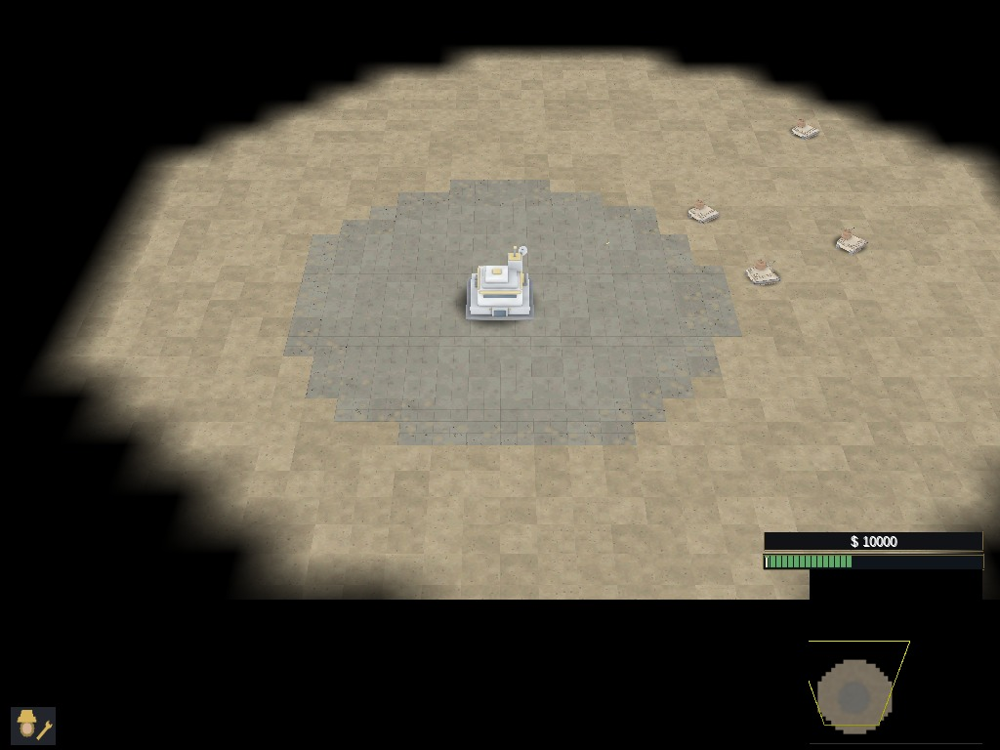

# War Powers

[](LICENSING.md)

A free real-time strategy game that runs in a desktop browser. Establish a
base, protect your supply line, scout the shroud and command a combined army as
the precise, power-hungry **Meridian Combine** or the scrappy, mobile
**Jackal Front** across the contested Meridian Strip. Nothing to install, no
game files to supply, no account.

**Status: pre-release.** War Powers is playable today by building it locally
(see [Play it](#play-it)). A hosted build is planned; nothing is deployed yet.


## What is in the game

- **Two asymmetric factions.** Meridian fields expensive, accurate hardware on
  a fragile power grid; Jackal fields cheap raiders and power-independent
  salvage infrastructure. Each has one signature power: the Directorate's
  Precision Strike or the Den's Tunnel Ambush.
- **Seven authored missions, all open from the start:** the Field Orientation
  training battle, a four-operation campaign (First Light, Cut the Wire, The
  Long Watch, War Powers) and two timed commander trials. Story order is a
  recommendation, never a lock.
- **Skirmish** on five layouts, from either faction's side, at three
  difficulty levels against an opponent that builds, expands, raids and
  retaliates.
- **A supply economy with physical haulers**, tech prerequisites, layered
  defences, artillery, aircraft and eight infantry roles.
- **Original art, voices and interface.** Every model, texture, map, icon
  and processed radio bark is project-authored through reproducible pipelines;
  the music rotation is attributed CC BY work.
- **Browser-local persistence:** settings, key remapping, audio channels, a
  checkpoint slot and an operation record with optional JSON backup. No
  telemetry.



## Play it

**Browser requirements:** a current desktop browser with WebGL2 and
WebAssembly (Chrome, Edge, Firefox or Safari). Keyboard and mouse; no mobile
or touch support.

**Build requirements:** Python 3.10+, CMake 3.25+, Ninja and an activated
[Emscripten SDK](https://emscripten.org/docs/getting_started/downloads.html);
Emscripten **6.0.8** is the tested version. Checked-in art is ready to use, so
Blender is only needed to regenerate it.

```sh
git clone https://github.com/abhishekpradhan/warpowers.git
cd warpowers
git submodule update --init engine
cd engine
emcmake cmake --preset wasm
cmake --build build/wasm --target GeneralsXZH.js
cd ..
python3 tools/genwebstage.py
python3 tools/serve.py
```

Open **http://localhost:8322** and choose **Operations → Field Orientation**
for the guided first battle. The first configure downloads the engine's
dependencies and the first build takes a while; staging and serving are
seconds. The `engine` submodule is all the browser build needs;
`git submodule update --init --recursive` (or `git clone --recursive`) also
fetches the engine's nested DXVK fork and OpenSAGE.BlenderPlugin checkouts,
which only native development and art regeneration use.
[CONTRIBUTING.md](CONTRIBUTING.md) covers rebuilding, tests and diagnostics.

## Project layout

| Path | Contents |
|---|---|
| `data/` | Game rules (INI), maps, models, textures, audio, layouts, strings and operation metadata |
| `web/` | The loader page, settings, objectives, operation record, checkpoints and credits |
| `tools/` | Reproducible content generators, validators, staging and the local server |
| `tests/` | Dependency-free web-state tests and the packaging and tool tests |
| `engine/` | GeneralsX engine fork compiled with Emscripten (Git submodule) |
| `dvijoke/` | Vendored D3D8 → WebGL2 renderer (`d8web`) |
| `licenses/` | Browser dependency inventory and notices |
| `docs/` | Vision, creative bible, roadmap, decision log, engine notes, testing |

## Documentation

- [CONTRIBUTING.md](CONTRIBUTING.md) — toolchain, build, tests, pull requests
- [docs/README.md](docs/README.md) — index of the design and engineering docs
- [docs/roadmap.md](docs/roadmap.md) — what is done, what is next, what is not planned
- [RELEASING.md](RELEASING.md) — how a public build is staged and published
- [CHANGELOG.md](CHANGELOG.md) — notable changes
- [LICENSING.md](LICENSING.md) — the complete license map

## License

Code in this repository is [MIT](LICENSE); project-authored game content is
CC BY 4.0; imported files keep their own licenses, recorded per file in
[ASSETS.md](ASSETS.md) and credited in [CREDITS.md](CREDITS.md). The engine
fork in `engine/` is GPL-3.0 with EA's additional terms, so the compiled
browser game ships under the GPL together with its corresponding source. See
[LICENSING.md](LICENSING.md) for the boundaries and obligations.

War Powers is not affiliated with or endorsed by Electronic Arts. No EA assets
or game data are included, and EA names appear only to identify the engine's
source lineage.
