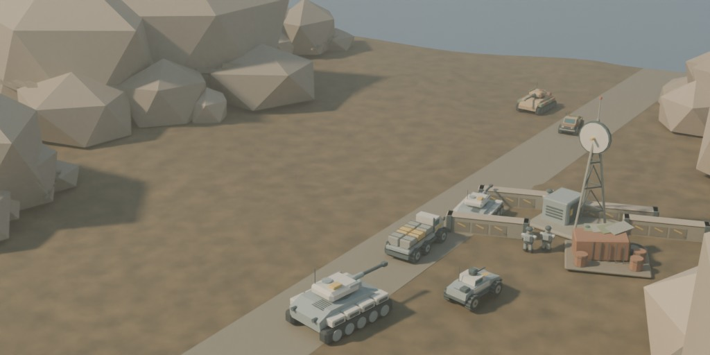

# War Powers



A free real-time strategy game built for the browser: establish a base,
protect your supply lines, scout the shroud and command a combined army.
The Meridian Combine's precise, power-dependent hardware faces the Jackal
Front's mobile salvage force across the contested Meridian Strip.

War Powers uses the community GeneralsX engine lineage, compiled to
WebAssembly, with independently authored game content. No retail game files
are required. This is a playable development build, currently private while
its product and release checks are completed.

## Play

- Two factions with distinct economies, unit costs and battlefield powers.
- Five skirmish battlefields, each available from either faction's side,
  with three opposition levels.
- Guided Field Orientation, a four-operation campaign and two commander
  trials, all available immediately, with different objectives and briefings.
- Optional completion records and best times, with Download/Restore record
  in Operations. No account or past wins are needed to access content.
- Original low-poly vehicles, infantry, structures and environment art;
  a widescreen command interface, unit voices and an attributed music rotation.
- Field manual, audio channels, control settings, pause and a browser-local
  checkpoint slot. Save compatibility is checked when the build changes.

## Run locally

Requires Python 3.10+, CMake, Ninja and an activated
[Emscripten SDK](https://emscripten.org/docs/getting_started/downloads.html).
Emscripten 6.0.8 is the currently tested version. Checked-in art is ready to
use; Blender is only needed when regenerating it.

```sh
git clone --recursive https://github.com/abhishekpradhan/warpowers.git
cd warpowers/engine
emcmake cmake --preset wasm
cmake --build build/wasm --target GeneralsXZH.js
cd ..
python3 tools/genwebstage.py
python3 tools/serve.py
```

Open **http://localhost:8322** in a desktop browser with WebGL2 enabled.
Choose **Operations → Field Orientation** for the guided first battle.
Field Guidance shows each step's remaining requirements. Collapse it with ×,
reopen it with **Guidance** beside the mission briefing, or use **All steps**
to review the training sequence.
The server listens only on this machine. Source updates require rebuilding
when appropriate, staging again, and refreshing the browser.
Keep the same URL between sessions: different hostnames or ports have separate
browser records and checkpoints. Reuse a running server instead of starting
another on a different port.

See [CONTRIBUTING.md](CONTRIBUTING.md) for tests and
[docs/WORKSPACE.md](docs/WORKSPACE.md) for repository and native-build details.
The [publish checklist](docs/publish-checklist.md) separates local evidence
from the browser, hardware and hosting checks still required for release.

## Project layout

| Path | Contents |
|---|---|
| `data/` | Game rules, maps, models, textures, audio, layouts and operation metadata |
| `web/` | Loader, settings, objectives, operation record, saves and credits |
| `tools/` | Reproducible content generators, validators and release packaging |
| `tests/` | Dependency-free web-state and packaging regression tests |
| `engine/` | GeneralsX fork; a separate Git submodule |
| `dvijoke/` | Vendored D3D8 → WebGL2 renderer with its MIT license |
| `docs/` | Vision, creative direction, current roadmap and verification evidence |

The native macOS development path uses the engine's nested DXVK fork.
It is not part of the browser renderer. The root, engine and DXVK source
repositories form the maintained project; push child commits before the
parent gitlinks so recursive clones remain reproducible.

## License and credits

Root code is [MIT](LICENSE); project-authored content is CC BY 4.0. Imports
retain their own licenses. The engine is GPL-3.0 with EA's additional terms;
its compiled distribution must retain the applicable source and notices.
See [LICENSING.md](LICENSING.md), the per-file [asset ledger](ASSETS.md),
and [credits](CREDITS.md) for the boundaries and acknowledgements.

No EA assets or game data ship with this project. EA names identify the
engine source lineage only; War Powers is not affiliated with or endorsed
by Electronic Arts. Contributions must preserve this separation and the
recorded provenance of all content.
